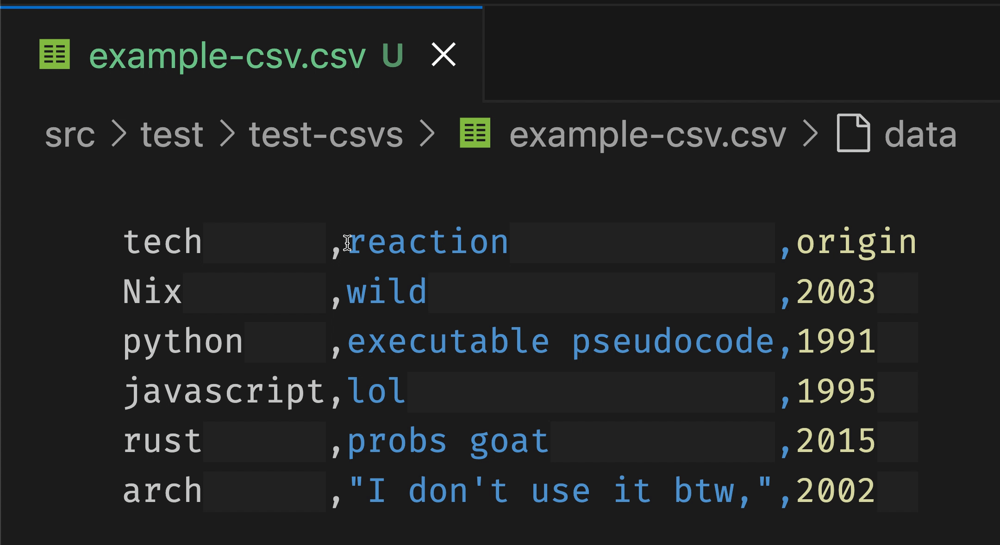

Hi 👋, I’m Grant, welcome to my GitHub!

My current projects are 

CSV aligner VSCode extension 👇 and
NixOS 👇👇

# CSV Aligner

This is a VSCode extension that uses the inlay hints to
render csvs as columns.

# NixOS

I've recently been getting into
the nix ecosystem. Here's
a YouTube video in which I show how to start NixOS
in a virtual machine. 

And  are my home manager configs

My resume site is [here](https://github.com/GSmithApps/home-manager-config).

