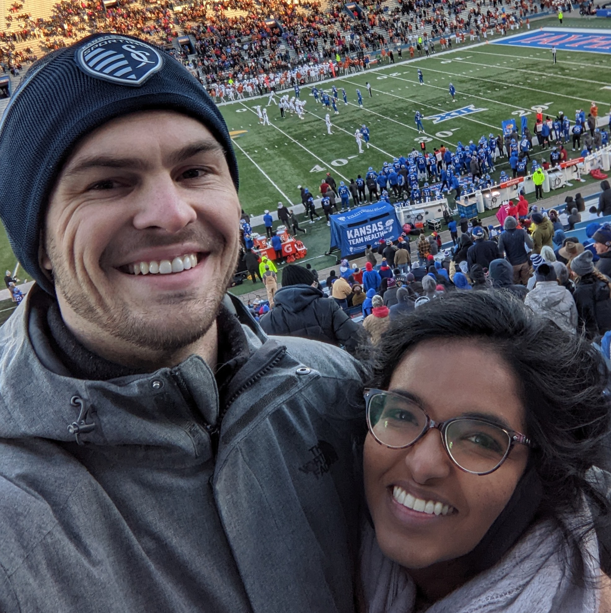

Hi, I'm Grant. Welcome to my site!

I'm a 30 year old dude living in Lawrence Kansas.

I live in an apartment with my girlfriend Dhanya,
and her/my cat, Samosa. I have two older brothers named
Drew and Derek, and my parents are Audrey and David.

Professionally, I am a programmer, advocate, and
teacher. I love programming, math, and science,
and I like to use those things at work.

# My Approach

One thing I do is approach work like a programmer.
For example, I like to use git, code, and markdown.

I also like to record things so other people can
use them in the future. For example, instead of
sending an email or taking my own notes, I try
to put them in some documentation so other people
can use them.

# Contact/Social

- [LinkedIn](https://www.linkedin.com/in/grant-smith-895b64a4/)
- [YouTube](https://www.youtube.com/@grantsmith3653/featured)
- [GitHub](https://github.com/GSmithApps)
- [Kaggle](https://www.kaggle.com/grannysmithapples)
- [GeoGebra](https://www.geogebra.org/u/gsmithapples)
- [Medium](https://medium.com/@14.gsmith.14)
- `14 dot gsmith dot 14 at gmail`

# Pic

Dhanya and me:

